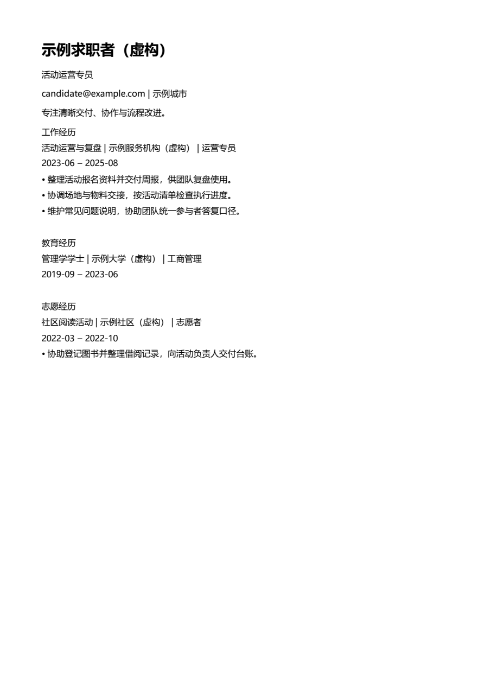

# Resume Workbench · 通用求职简历工作台

### 用真实经历制作可编辑简历的 Codex skill

**从个人叙述、旧简历和可选公开 GitHub 项目整理经历，交付可编辑 Word 及从该 Word 导出的 PDF。可按岗位调整内容、采用用户导入的 Word/PDF 版式，也能从最新手工编辑的 Word 继续修改。**

[English](README.md) | 中文

[快速开始](#快速开始) · [主要功能](#主要功能) · [使用方法](#使用方法) · [文档](#文档)



*虚构的中文运营简历示例：由实际生成的 Word 导出 PDF，再渲染成图。图片展示真实输出。*

## 主要功能

- **以已确认经历为基础。** 分开保存事实、来源、岗位选择和模板；模板样例不能成为个人经历，仓库归属也不能证明个人贡献。
- **多种资料入口。** 可从用户描述、旧简历或可选公开 GitHub 素材开始。虚构示例包含技术学生、运营求职者和英文有经验求职者。
- **按岗位生成版本。** 根据 JD 说明相关经历与缺口，显式选择写入的经历；没有 JD 也可制作通用版。
- **可编辑 Word 与对应 PDF。** 支持默认版式、普通段落/简单表格 DOCX，以及将文字层 PDF 参考版式重建为 Word；报告不支持的位置和重建差异。
- **从最新 Word 续编。** 无需历史记录，修改副本、保留原件，再从修改后的 Word 导出新 PDF。

流程适用于不同行业和职业阶段。可从个人叙述或旧简历开始，再按需要补充公开 GitHub 素材。

## 快速开始

### 1. 准备环境

需要 Python 3.10+。导出 PDF 还需要能在当前桌面会话工作的 Windows Microsoft Word，或可用的 LibreOffice。Windows Word 路径已用真实文件实测；LibreOffice 及其他操作系统尚未完成同等程度的端到端验证。

```powershell
git clone https://github.com/cloudwallker/resume-workbench-skill.git resume-workbench
cd resume-workbench
python -m venv .venv
.\.venv\Scripts\python.exe -m pip install -r requirements.txt
.\.venv\Scripts\python.exe skills/resume-workbench/scripts/resume.py doctor
```

macOS/Linux 的环境命令使用 `.venv/bin/python`。Codex 桌面也可能提供自带的文档运行时；skill 会先检查可用运行时，再准备独立环境。

### 2. 安装 Codex skill

将整个 `skills/resume-workbench` 目录复制到个人 Codex skills 目录，例如 `~/.codex/skills/resume-workbench`。已有安装时先保留原版本。安装后开启新的 Codex 对话并调用：

```text
$resume-workbench 根据我的经历和目标岗位，制作 Word 与 PDF 简历。
```

个人资料、导入原件和生成文件应存放在独立工作目录，不能写进 skill 包或公开示例。

### 3. 试运行虚构示例

```powershell
.\.venv\Scripts\python.exe skills/resume-workbench/scripts/resume.py build --master skills/resume-workbench/assets/examples/operations-zh.json --outdir output --workspace workspaces/demo
```

命令创建独立版本目录，包含 Word、转换成功时的 PDF 和检查报告。逐页查看渲染后的 PDF，才能认定文件已完成审阅。明确只需要 Word 时加 `--docx-only`；未安装转换器时，默认双格式请求返回 `partial`，Word 文件会保留。

## 使用方法

以下 `python` 指已准备环境中的 Python。完整命令和参数可通过 `--help` 查看。

```text
python skills/resume-workbench/scripts/resume.py --help
python skills/resume-workbench/scripts/resume.py validate master.json
python skills/resume-workbench/scripts/resume.py tailor --master master.json --jd JD.txt
python skills/resume-workbench/scripts/resume.py github octocat/Hello-World
python skills/resume-workbench/scripts/resume.py analyze-template template.docx
```

`tailor` 提供有依据的建议，不自动修改事实或选用经历。构建时可多次使用 `--select <id>` 指定内容。GitHub 读取仅访问公开 API/README，不运行仓库代码；结果仍为待确认素材，需确认个人贡献。

### 导入模板

```text
python skills/resume-workbench/scripts/resume.py build --master master.json --template template.docx --mapping mapping.json --outdir output
python skills/resume-workbench/scripts/resume.py build --master master.json --template reference.pdf --allow-rebuild --outdir output
```

普通段落及简单表格 DOCX 支持占位符、标题识别和显式映射。文字层 PDF 用于提取版式参数并重建可编辑 Word，不能保证无损转换。扫描 PDF 需要经过 OCR 的文字层来源或可编辑原件：本项目会返回 `needs_ocr`，尚未集成 OCR 工作流。浮动文本框、嵌套/合并表格等复杂设计需要检查与适配。旧 `.doc` 文件在转换器可用时可先转为新的 DOCX。

### 续编与检查

```text
python skills/resume-workbench/scripts/resume.py continue --latest latest.docx --replacements changes.json --outdir output
python skills/resume-workbench/scripts/resume.py export --docx final.docx --outdir preview
python skills/resume-workbench/scripts/resume.py check --docx resume.docx --pdf resume.pdf --payload payload.json --render-dir pages
```

续编以用户最新的 Word 为准，包括手工修改。`export` 复制该 Word，保持字节不变，再导出 PDF；仅要求交付 Word 时，也可用它生成内部版式预览。

自动检查覆盖正文、数字、链接、占位符、来源哈希和 PDF 可提取性/页数。成功导出后状态为 `needs_visual_review`，仍须实际查看所有页面。其他状态包括 `docx_only`、`partial`、`quality_failed`；退出码 `2` 表示错误或缺少必要条件。审阅记录绑定当前文件哈希，文件修改后需要重新导出和审阅。

## 文档

- [Skill 使用指令](skills/resume-workbench/SKILL.md)
- [数据格式](skills/resume-workbench/references/data-model.md)
- [经历写作与岗位定制](skills/resume-workbench/references/content-and-targeting.md)
- [模板映射与重建](skills/resume-workbench/references/templates.md)
- [导出与文件检查](skills/resume-workbench/references/files-and-export.md)
- [从 Word 续编](skills/resume-workbench/references/continuation.md)
- [验证说明与复现方法](docs/verification.md)

配套详细参考文档目前使用中文。全部内置求职者示例均为虚构资料。

## 开发与本地打包

```text
python tools/run_tests.py
python tools/build_release.py --outdir dist
python tools/install_skill.py dist/resume-workbench-0.1.0.zip --skills-dir "<个人 Codex skills 目录>"
```

使用 ZIP 安装器前，需先在本机构建 ZIP。安装器检查归档路径和清单哈希；替换已有 skill 时，`--backup-existing` 会保留旧版。打包采用明确的资源清单，排除个人工作区、输出、缓存和环境文件。单元测试及真实 Word/PDF 场景见[验证说明](docs/verification.md)。

## 贡献者与许可

项目贡献者：[cloudwallker](https://github.com/cloudwallker)。

采用 [MIT 许可证](LICENSE)，© 2026 [cloudwallker](https://github.com/cloudwallker)。安装的技能包内也保留 LICENSE 副本。第三方依赖、用户提供的简历和参考模板仍遵循各自的权利与许可。
